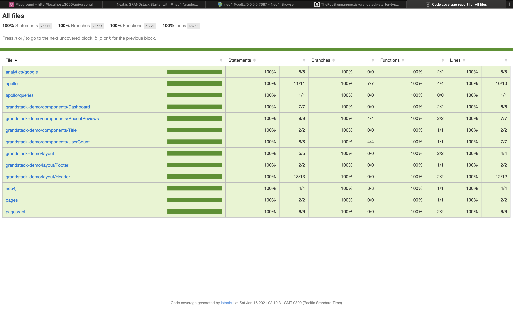

# GRANDstack Starter for Next.js with TypeScript

This project is a starter for building a [GRANDstack](https://grandstack.io) ([GraphQL](https://graphql.org), [React](https://reactjs.org), [Apollo](https://www.apollographql.com), [Neo4j Database](https://neo4j.com)) application using [Next.js](https://nextjs.org) and [TypeScript](https://www.typescriptlang.org) instead of the original [create-react-app](https://reactjs.org/docs/create-a-new-react-app.html) example available at [https://github.com/grand-stack/grand-stack-starter](https://github.com/grand-stack/grand-stack-starter).

[DEMO: Next.js GRANDstack app](https://nextjs-grandstack-starter-typescript.vercel.app)

[DEMO: GraphQL explorer](https://nextjs-grandstack-starter-typescript.vercel.app/api/graphql)

## Getting started

### Create a Next.js app from scratch

```sh
# Navigate to your desired directory (such as app)
$ npm init  # Creates a package.json with common values for your app

# Install required Next.js and React dependencies
$ npm install next react react-dom

# Create a pages directory
$ mkdir pages

# Create a default page
$ cd pages
$ touch index.js
```

Create a simple default page:

```jsx
// app/pages/index.js
const DefaultPage = () => {
  return <div>Welcome to Next.js!</div>
}

export default DefaultPage
```

Once you have created the default page, you can now run your app with:

```sh
$ npm run dev
```

You should be able to view your application at [http://localhost:3000](http://localhost:3000). 🤓

### TypeScript

To add [TypeScript](https://www.typescriptlang.org) to your [Next.js](https://nextjs.org) app:

```sh
# Navigate to your app directory
$ cd app

# Install TypeScript dev dependencies
$ npm i -D typescript @types/react @types/node

# Create an empty tsconfig.json file
$ touch tsconfig.json

# Run your app and Next.js will automatically discover and configure TypeScript for you
$ npm run dev
```

## Tests

This project uses [Jest](https://jestjs.io/) and [Enzyme](https://enzymejs.github.io/enzyme/) for unit and integration tests.

The following scripts are available at both the top level project directory as well as the `app` directory:

- `npm run test` or `npm test` - This runs a single run of the Jest tests for our project.
- `npm run test:ci` - Useful for running Jest tests in a continuous integration (CI) environment
  - See [https://jestjs.io/docs/en/cli#--ci](https://jestjs.io/docs/en/cli#--ci) for more details
- `npm run test:coverage` - Generates a code coverage report of the Jest tests

  ```sh

  PASS  __tests__/index.test.tsx
    The default page
      ✓ should contain placeholder text (27 ms)

  -----------|---------|----------|---------|---------|-------------------
  File       | % Stmts | % Branch | % Funcs | % Lines | Uncovered Line #s
  -----------|---------|----------|---------|---------|-------------------
  All files  |     100 |      100 |     100 |     100 |
  index.tsx  |     100 |      100 |     100 |     100 |
  -----------|---------|----------|---------|---------|-------------------
  Test Suites: 1 passed, 1 total
  Tests:       1 passed, 1 total
  Snapshots:   0 total
  Time:        2.032 s
  Ran all test suites.

  ```

- `npm run test:coverage:view` - Generates a code coverage report of the Jest tests and automatically launches a web browser on macOS/linux to interactively see what code is and is not being covered in tests



- `npm run test:watch` - Runs Jest in `--watch` mode; running tests related to current code changes and not the entire suite

## Bundle analysis

This project uses the [Next.js + Webpack Bundle Analyzer](https://github.com/vercel/next.js/tree/canary/packages/next-bundle-analyzer) to generate bundle analysis of both client and server bundles by running the `npm run analyze` script:


## Static files

The `public` folder in your [Next.js](https://nextjs.org) app can be used to serve whatever assets you desire (e.g. `app/public/logo.png` would be available at http://localhost:3000/logo.png)

## Back-end API

One benefit of developing with [Next.js](https://nextjs.org) and deploying to [Vercel](https://vercel.com/) is that any files contained within your `pages/api` folder will be separate serverless functions.

In our case, we have two serverless functions that we are exposing:

- `ping` - Displays a simple message to verify our serverless functions are online
- `graphql` - This is the GraphQL endpoint our application and our GraphIQL IDE will use

For more details, please refer to [Vercel Serverless Functions](https://vercel.com/docs/serverless-functions/introduction)

### GraphQL

You can explore your GraphQL schema using the GraphIQL IDE - available at [http://localhost:3000/api/graphql](http://localhost:3000/api/graphql)

### Ping

To verify your back-end API is running, you should be able to visit [http://localhost:3000/api/ping](http://localhost:3000/api/ping) and see a response.

## Third-party services

### Apollo GraphQL

This project has an example [Apollo GraphQL](https://www.apollographql.com) server up and running at `/api/graphql`

If you are running this project locally, you can view the [GraphIQL IDE](http://localhost:3000/api/graphql) at [http://localhost:3000/api/graphql](http://localhost:3000/api/graphql)

### Google Analytics

This project uses [Google Analytics](http://analytics.google.com) to track user interactions and evaluate the usage of the application.

### Vercel

This project has been configured to automatically deploy to [Vercel](https://vercel.com/) using the [Vercel for GitHub](https://vercel.com/github) integration.

#### Environment variables

We can define the environment variables we would like to use for our `Production`, `Preview`, and `Development` environments. Navigate to your [Vercel](https://vercel.com/) project settings and define your environment variables as you'd like 🤓

Please see [https://vercel.com/docs/v2/build-step#environment-variables](https://vercel.com/docs/v2/build-step#environment-variables) and/or [https://nextjs.org/docs/basic-features/environment-variables](https://nextjs.org/docs/basic-features/environment-variables) for details on defining environment variables for your application on [Vercel](https://vercel.com/).
