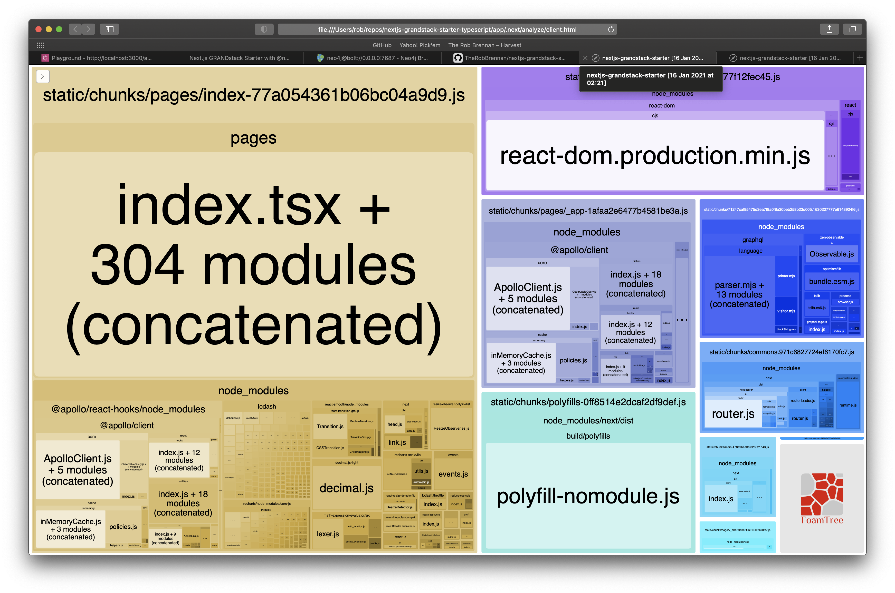
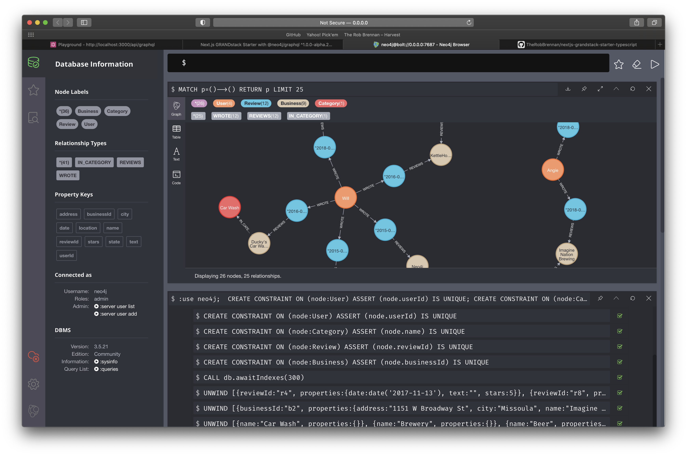

# GRANDstack Starter for Next.js with TypeScript

This project is a starter for building a [GRANDstack](https://grandstack.io) ([GraphQL](https://graphql.org), [React](https://reactjs.org), [Apollo](https://www.apollographql.com), [Neo4j Database](https://neo4j.com)) application using [Next.js](https://nextjs.org) and [TypeScript](https://www.typescriptlang.org) instead of the original [create-react-app](https://reactjs.org/docs/create-a-new-react-app.html) example available at [https://github.com/grand-stack/grand-stack-starter](https://github.com/grand-stack/grand-stack-starter).

[DEMO: Next.js GRANDstack app](https://nextjs-grandstack-starter-typescript.vercel.app)


[DEMO: GraphQL explorer](https://nextjs-grandstack-starter-typescript.vercel.app/api/graphql)


## Getting started

### Create a Next.js app from scratch

```sh
# Navigate to your desired directory (such as app)
$ npm init  # Creates a package.json with common values for your app

# Install required Next.js and React dependencies
$ npm install next react react-dom

# Create a pages directory
$ mkdir pages

# Create a default page
$ cd pages
$ touch index.js
```

Create a simple default page:

```jsx
// app/pages/index.js
const DefaultPage = () => {
  return <div>Welcome to Next.js!</div>
}

export default DefaultPage
```

Once you have created the default page, you can now run your app with:

```sh
$ npm run dev
```

You should be able to view your application at [http://localhost:3000](http://localhost:3000). 🤓

### TypeScript

To add [TypeScript](https://www.typescriptlang.org) to your [Next.js](https://nextjs.org) app:

```sh
# Navigate to your app directory
$ cd app

# Install TypeScript dev dependencies
$ npm i -D typescript @types/react @types/node

# Create an empty tsconfig.json file
$ touch tsconfig.json

# Run your app and Next.js will automatically discover and configure TypeScript for you
$ npm run dev
```

## Tests

This project uses [Jest](https://jestjs.io/) and [Enzyme](https://enzymejs.github.io/enzyme/) for unit and integration tests.

The following scripts are available at both the top level project directory as well as the `app` directory:

- `npm run test` or `npm test` - This runs a single run of the Jest tests for our project.
- `npm run test:ci` - Useful for running Jest tests in a continuous integration (CI) environment
  - See [https://jestjs.io/docs/en/cli#--ci](https://jestjs.io/docs/en/cli#--ci) for more details
- `npm run test:coverage` - Generates a code coverage report of the Jest tests

```sh
 PASS  __tests__/api/ping.test.ts
 PASS  apollo/type-defs.test.ts
 PASS  apollo/resolvers.test.ts
 PASS  analytics/google/googleAnalytics.test.ts
 PASS  apollo/client.test.ts
 PASS  __tests__/index.test.tsx
 PASS  neo4j/db.test.ts
 PASS  apollo/schema.test.ts (6.365 s)
 PASS  __tests__/api/graphql.test.ts (6.979 s)
---------------------|---------|----------|---------|---------|-------------------
File                 | % Stmts | % Branch | % Funcs | % Lines | Uncovered Line #s
---------------------|---------|----------|---------|---------|-------------------
All files            |     100 |      100 |     100 |     100 |
 analytics/google    |     100 |      100 |     100 |     100 |
  googleAnalytics.ts |     100 |      100 |     100 |     100 |
 apollo              |     100 |      100 |     100 |     100 |
  client.ts          |     100 |      100 |     100 |     100 |
  resolvers.ts       |     100 |      100 |     100 |     100 |
  schema.ts          |     100 |      100 |     100 |     100 |
  type-defs.ts       |     100 |      100 |     100 |     100 |
 apollo/queries      |     100 |      100 |     100 |     100 |
  hello.ts           |     100 |      100 |     100 |     100 |
 neo4j               |     100 |      100 |     100 |     100 |
  db.ts              |     100 |      100 |     100 |     100 |
 pages               |     100 |      100 |     100 |     100 |
  index.tsx          |     100 |      100 |     100 |     100 |
 pages/api           |     100 |      100 |     100 |     100 |
  graphql.ts         |     100 |      100 |     100 |     100 |
  ping.ts            |     100 |      100 |     100 |     100 |
---------------------|---------|----------|---------|---------|-------------------

Test Suites: 9 passed, 9 total
Tests:       37 passed, 37 total
Snapshots:   0 total
Time:        8.284 s
Ran all test suites.

```

- `npm run test:coverage:view` - Generates a code coverage report of the Jest tests and automatically launches a web browser on macOS/linux to interactively see what code is and is not being covered in tests


- `npm run test:watch` - Runs Jest in `--watch` mode; running tests related to current code changes and not the entire suite

## Bundle analysis

This project uses the [Next.js + Webpack Bundle Analyzer](https://github.com/vercel/next.js/tree/canary/packages/next-bundle-analyzer) to generate bundle analysis of both client and server bundles by running the `npm run analyze` script:




## Static files

The `public` folder in your [Next.js](https://nextjs.org) app can be used to serve whatever assets you desire (e.g. `app/public/logo.png` would be available at http://localhost:3000/logo.png)

## Back-end API

One benefit of developing with [Next.js](https://nextjs.org) and deploying to [Vercel](https://vercel.com/) is that any files contained within your `pages/api` folder will be separate serverless functions.

In our case, we have two serverless functions that we are exposing:

- `ping` - Displays a simple message to verify our serverless functions are online
- `graphql` - This is the GraphQL endpoint our application and our GraphIQL IDE will use

For more details, please refer to [Vercel Serverless Functions](https://vercel.com/docs/serverless-functions/introduction)

### GraphQL

You can explore your GraphQL schema using the GraphIQL IDE - available at [http://localhost:3000/api/graphql](http://localhost:3000/api/graphql)

### Ping

To verify your back-end API is running, you should be able to visit [http://localhost:3000/api/ping](http://localhost:3000/api/ping) and see a response.

## Third-party services

### Apollo GraphQL

This project has an example [Apollo GraphQL](https://www.apollographql.com) server up and running at `/api/graphql`

If you are running this project locally, you can view the [GraphIQL IDE](http://localhost:3000/api/graphql) at [http://localhost:3000/api/graphql](http://localhost:3000/api/graphql)

### Docker

If you would like to have your [Neo4j Database](https://neo4j.com) running in a [Docker](https://www.docker.com) environment, you can easily build, start, and stop versions of [Neo4j Database](https://neo4j.com) to your heart's content!

To run this example, all you need to have installed on your system is [Docker](https://www.docker.com) and `npm` installed on your development system - which is automatically included if you downloaded and installed [Node.js](https://nodejs.org/).

If you do not have [Docker](https://www.docker.com) installed on your development system, go to freely available [Docker Desktop](https://www.docker.com/products/docker-desktop) and get that installed and configured on your development machine.

If you already have `npm` and [Docker](https://www.docker.com) installed on your development system, simply run:

Neo4j v3.5 - [Neo4j Browser](https://neo4j.com/developer/neo4j-browser/) available at [http://localhost:7474/browser/](http://localhost:7474/browser/)

```sh
# Build the Docker infrastructure from scratch
$ npm run docker:build       # Uses Neo4j v3.5

# Start the project
$ npm run docker:start       # Uses Neo4j v3.5

# Stop the Docker containers from running
$ npm run docker:stop       # Uses Neo4j v3.5
```

Neo4j v4.0 - [Neo4j Browser](https://neo4j.com/developer/neo4j-browser/) available at [http://0.0.0.0:7474/browser/](http://0.0.0.0:7474/browser/)

```sh
# Build the Docker infrastructure from scratch
$ npm run docker:build:v4.0  # Uses Neo4j v4.0

# Start the project
$ npm run docker:start:v4.0  # Uses Neo4j v4.0

# Stop the Docker containers from running
$ npm run docker:stop:v4.0  # Uses Neo4j v4.0
```

In the default configuration, all data is ephemeral and will not be persisted. If you would like to persist [Neo4j Database](https://neo4j.com) data or settings, please refer to the appropriate Docker compose files for examples on how to accomplish this.

### Google Analytics

This project uses [Google Analytics](http://analytics.google.com) to track user interactions and evaluate the usage of the application.

### Neo4j

The [Neo4j Database](https://neo4j.com) is the cornerstone of our GRANDstack application.

Once you have defined the environment variables - either in `app/.env` for local development or the appropriate places for your environment - you can have a [Neo4j Database](https://neo4j.com) hosted anywhere you'd like.

[Neo4j](https://neo4j.com) has three options to get you up and running quickly:

- [Neo4j Desktop](https://neo4j.com/download/) - FREE - Perfect for exploring [Neo4j](https://neo4j.com) on your local machine
- [Neo4j Sandbox](https://sandbox.neo4j.com) - FREE - This allows you to run short-lived Neo4j projects in the cloud for free
- [Neo4j Aura](https://neo4j.com/cloud/aura/) - \$ - This is [Neo4j](https://neo4j.com)'s flagship offering with a developer-friendly graph database as a service.

All you will need is the bolt URL and the credentials to access your database.

#### Sample data

The original [https://github.com/grand-stack/grand-stack-starter](https://github.com/grand-stack/grand-stack-starter) had a helper script to seed your [Neo4j Database](https://neo4j.com) with example data. That same example database is available for you in a series of Cypher commands.

Once you have connected to your [Neo4j Database](https://neo4j.com) with [Neo4j Browser](https://neo4j.com/developer/neo4j-browser/), simply copy the text as is from `app/neo4j/__seed__/db.cypher` and execute the Cypher commands in a single action:


You can verify that your [Neo4j Database](https://neo4j.com) has been successfully created:




### Vercel

This project has been configured to automatically deploy to [Vercel](https://vercel.com/) using the [Vercel for GitHub](https://vercel.com/github) integration.

#### Environment variables

We can define the environment variables we would like to use for our `Production`, `Preview`, and `Development` environments. Navigate to your [Vercel](https://vercel.com/) project settings and define the following environment variables:

```sh
GOOGLE_ANALYTICS_TRACKING_ID=UA-156456153-7
NEO4J_URI=bolt://18.207.112.93:33129
NEO4J_USER=neo4j
NEO4J_PASSWORD=rewards-railroad-rowers

# Enable encrypted driver connection for Neo4j
#NEO4J_ENCRYPTED=true

# Specify a specific Neo4j database (v4.x+ only)
#NEO4J_DATABASE=neo4j
```

Please refer to `app/.env.sample` to see the latest environment variables that you will need to declare in the event the above list is incomplete.

Please see [https://vercel.com/docs/v2/build-step#environment-variables](https://vercel.com/docs/v2/build-step#environment-variables) and/or [https://nextjs.org/docs/basic-features/environment-variables](https://nextjs.org/docs/basic-features/environment-variables) for details on defining environment variables for your application on [Vercel](https://vercel.com/).
