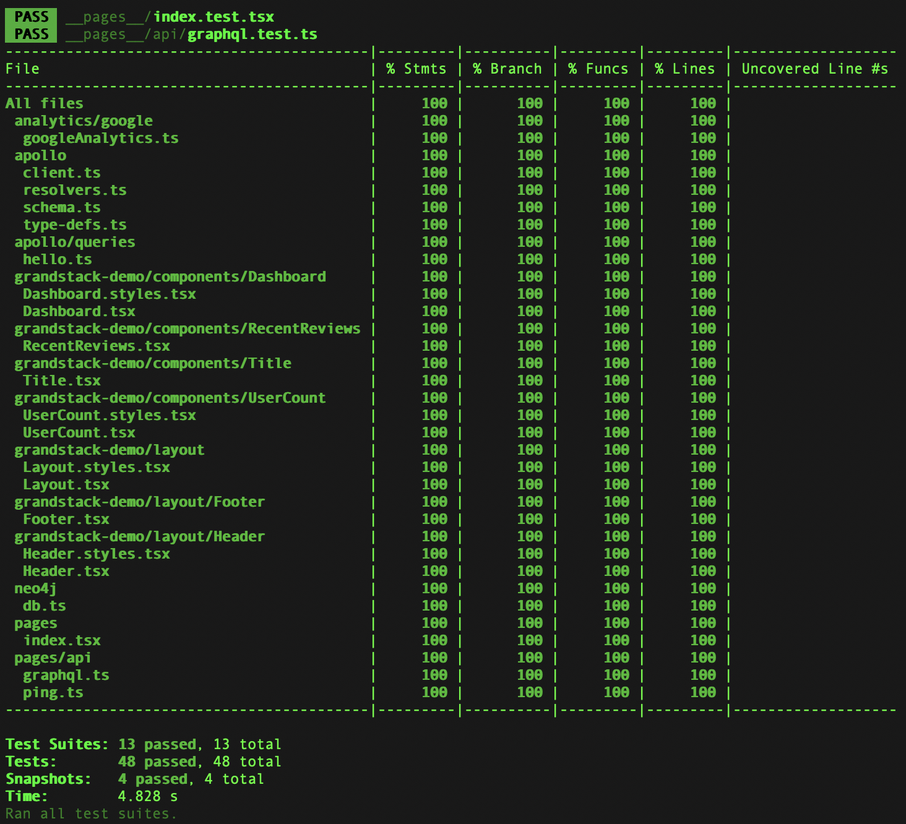
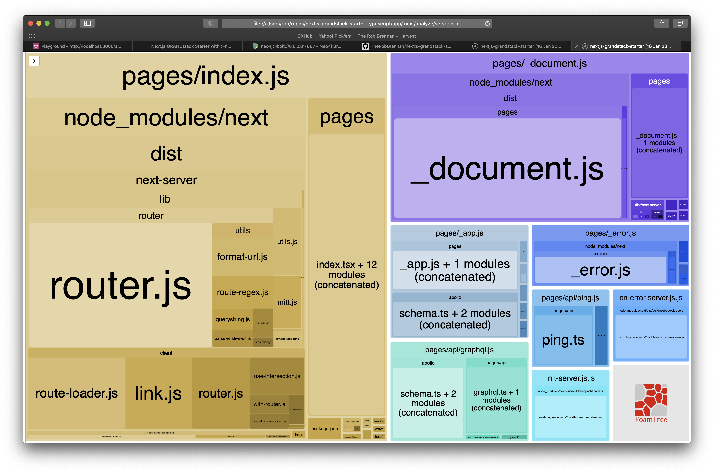
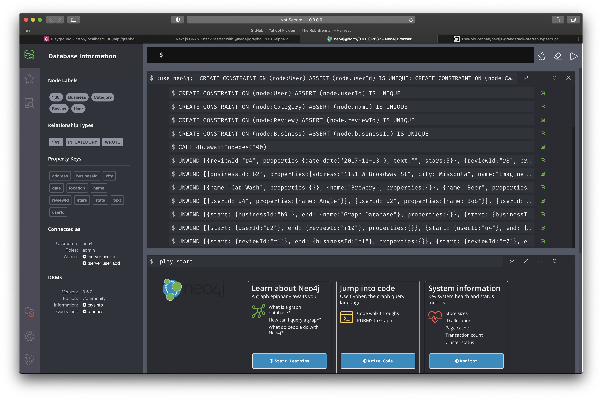

# GRANDstack Starter for Next.js with TypeScript

**What's new in 2021?**

A lot. 🎉

On Thursday, January 14th, 2021, Neo4j had a big announcement in their GraphQL Community Call.

As part of the initial [GRANDstack](https://grandstack.io) ([GraphQL](https://graphql.org), [React](https://reactjs.org), [Apollo](https://www.apollographql.com), [Neo4j Database](https://neo4j.com)) offering, Neo4j labs had created [https://github.com/neo4j-graphql/neo4j-graphql-js](https://github.com/neo4j-graphql/neo4j-graphql-js) - enabling developers to build a GraphQL API layer on top of an already existing Neo4j database and the Cypher query language.

Neo4j has announced this effort is graduating from a labs project into a fully supported Neo4j product for the GraphQL layer - `@neo4j/graphql`

This was a huge announcement; and I would encourage you to review the community call and materials below.

`@neo4j/graphql` is currently in early alpha release and is available NOW.

Useful resources

- [Neo4j GraphQL Community Call - January 2021](https://www.youtube.com/watch?v=Og2I2K21MdI)
- [Slide deck for the Community Call](https://docs.google.com/presentation/d/1GfdFUpYguMBUtWrrjSynGrJBkqfzHZYvffYScPltnDE/edit#slide=id.gb270d1e6e4_1_119)
- [@neo4j/graphql on npm](https://www.npmjs.com/package/@neo4j/graphql)
  - [https://github.com/neo4j/graphql-tracker-temp](https://github.com/neo4j/graphql-tracker-temp) - This is the temporary repo where you can submit issues, etc.
- [Neo4j on Slack](http://neo4j-users-slack-invite.herokuapp.com)

---

This project is a starter for building a [GRANDstack](https://grandstack.io) ([GraphQL](https://graphql.org), [React](https://reactjs.org), [Apollo](https://www.apollographql.com), [Neo4j Database](https://neo4j.com)) application using [Next.js](https://nextjs.org) and [TypeScript](https://www.typescriptlang.org) instead of the original [create-react-app](https://reactjs.org/docs/create-a-new-react-app.html) example available at [https://github.com/grand-stack/grand-stack-starter](https://github.com/grand-stack/grand-stack-starter).


## Getting started

To run this application as intended, you will need to:

- Build and run the Dockerized project
- Seed your Neo4j database with sample data

### Build and run the Dockerized project

If you would like to have your [Next.js](https://nextjs.org) application and [Neo4j Database](https://neo4j.com) running in a [Docker](https://www.docker.com) environment, you can quickly build, start, and stop versions of [Neo4j Database](https://neo4j.com) to your heart's content!

To run this example, all you need to have installed on your system is [Docker](https://www.docker.com) and `npm` installed on your development system.

If you do not have [Docker](https://www.docker.com) installed on your development system, go to freely available [Docker Desktop](https://www.docker.com/products/docker-desktop) and get that installed and configured on your development machine.

If you already have `npm` and [Docker](https://www.docker.com) installed on your development system, run:

```sh
# Run the project using Neo4j v3.5.x
$ npm run dev

# ALTERNATIVE: Run the project using Neo4j v4.x.x
$ npm run dev:v4
```

You should be able to access the following URLs:

- [http://localhost:7474/browser/](http://localhost:7474/browser/) - This is the Neo4j Browser application that you can use to explore your Neo4j database - as well as run Cypher commands to seed your database with example data
- [http://localhost:3000](http://localhost:3000) - The frontend for our Next.js application
- [http://localhost:3000/api/graphql](http://localhost:3000/api/graphql) - The GraphIQL explorer for our backend Next.js API which will be a serverless GraphQL function on Vercel
- [http://localhost:3000/api/ping](http://localhost:3000/api/ping) - A sample API route that will be a serverless function on Vercel

Additionally, the following scripts have been created for managing your Docker environment based on the version of Neo4j you are using.

Neo4j v3.5.x:

- `dev` - This starts the Dockerized project with services defined in `docker-compose.yml`
- `dev:clean` - This builds fresh images and containers for the Dockerized project with services defined in `docker-compose.yml`
- `dev:stop` - This stops the Dockerized project with services defined in `docker-compose.yml`

Neo4j v4.x.x:

- `dev:v4` - This starts the Dockerized project with services defined in `docker-compose-neo4j-v4.x.yml`
- `dev:v4:clean` - This builds fresh images and containers for the Dockerized project with services defined in `docker-compose-neo4j-v4.x.yml`
- `dev:v4:stop` - This stops the Dockerized project with services defined in `docker-compose-neo4j-v4.x.yml`

Docker

- `docker:destroy:global` - **WARNING: This command will delete all Docker images, containers, networks, and volumes for ALL Dockerized applications on your system**

### Seed your Neo4j database with sample data

Once your Dockerized project is running, you can navigate to the [Neo4j Browser](https://neo4j.com/developer/neo4j-browser/) at [http://0.0.0.0:7474/browser/](http://0.0.0.0:7474/browser/).

Open up `./app/neo4j/__seed__/db.cypher` so you can copy and paste the example Cypher statements into the Cypher window and press `play` to seed your database with example data.

## Tests

This project uses [Jest](https://jestjs.io/) and [Enzyme](https://enzymejs.github.io/enzyme/) for unit and integration tests.

The following scripts are available at both the top-level project directory as well as the `app` directory:

- `npm run test` or `npm test` - This runs a single run of the Jest tests for our project.
- `npm run test:ci` - Useful for running Jest tests in a continuous integration (CI) environment
  - See [https://jestjs.io/docs/en/cli#--ci](https://jestjs.io/docs/en/cli#--ci) for more details
- `npm run test:coverage` - Generates a code coverage report of the Jest tests



- `npm run test:coverage:view` - Generates a code coverage report of the Jest tests and automatically launches a web browser on macOS/Linux to interactively see what code is and is not being covered in tests


- `npm run test:verbose` - This displays verbose output during the execution of the Jest tests

- `npm run test:watch` - **This is the only test script that runs locally.** It runs Jest in `--watch` mode; running tests related to current code changes and not the entire suite

## Bundle analysis

This project uses the [Next.js + Webpack Bundle Analyzer](https://github.com/vercel/next.js/tree/canary/packages/next-bundle-analyzer) to generate bundle analysis of both client and server bundles by running the `npm run analyze` script:




## Static files

The `public` folder in your [Next.js](https://nextjs.org) app can be used to serve whatever assets you desire (e.g. `app/public/logo.png` would be available at [http://localhost:3000/logo.png](http://localhost:3000/logo.png))

## Back-end API

One benefit of developing with [Next.js](https://nextjs.org) and deploying to [Vercel](https://vercel.com/) is that any files contained within your `pages/api` folder will be separate serverless functions.

In our case, we have two serverless functions that we are exposing:

- `graphql` - This is the GraphQL endpoint our application and our GraphIQL IDE will use
- `ping` - Displays a simple message to verify our serverless functions are online

For more details, please refer to [Vercel Serverless Functions](https://vercel.com/docs/serverless-functions/introduction)

### GraphQL

You can explore your GraphQL schema using the GraphIQL IDE - available at [http://localhost:3000/api/graphql](http://localhost:3000/api/graphql)

### Ping

To verify your back-end API is running, you should be able to visit [http://localhost:3000/api/ping](http://localhost:3000/api/ping) and see a response.

## Third-party services

### Apollo GraphQL

This project has an example [Apollo GraphQL](https://www.apollographql.com) server up and running at `/api/graphql`

If you are running this project locally, you can view the [GraphIQL IDE](http://localhost:3000/api/graphql) at [http://localhost:3000/api/graphql](http://localhost:3000/api/graphql)

### Google Analytics

This project uses [Google Analytics](http://analytics.google.com) to track user interactions and evaluate the application's usage.

### Neo4j

The [Neo4j Database](https://neo4j.com) is the cornerstone of our GRANDstack application.

Once you have defined the environment variables - either in `app/.env` for local development or the appropriate places for your environment - you can have a [Neo4j Database](https://neo4j.com) hosted anywhere you'd like.

[Neo4j](https://neo4j.com) has three options to get you up and running quickly:

- [Neo4j Desktop](https://neo4j.com/download/) - FREE - Perfect for exploring [Neo4j](https://neo4j.com) on your local machine
- [Neo4j Sandbox](https://sandbox.neo4j.com) - FREE - This allows you to run short-lived Neo4j projects in the cloud for free
- [Neo4j Aura](https://neo4j.com/cloud/aura/) - \$ - This is [Neo4j](https://neo4j.com)'s flagship offering with a developer-friendly graph database as a service.

All you will need is the bolt URL and the credentials to access your database.

#### Sample data

The original [https://github.com/grand-stack/grand-stack-starter](https://github.com/grand-stack/grand-stack-starter) had a helper script to seed your [Neo4j Database](https://neo4j.com) with example data. That same example database is available for you in a series of Cypher commands.

Once you have connected to your [Neo4j Database](https://neo4j.com) with [Neo4j Browser](https://neo4j.com/developer/neo4j-browser/), simply copy the text as is from `app/neo4j/__seed__/db.cypher` and execute the Cypher commands in a single action:




You can verify that your [Neo4j Database](https://neo4j.com) has been successfully created:


### Vercel

This project is ready to be configured for deployment to [Vercel](https://vercel.com/), as well as optionally using the [Vercel for GitHub](https://vercel.com/github) integration for automatic deployment.

#### Environment variables

We can define the environment variables we would like to use for our `Production,` `Preview,` and `Development` environments. Navigate to your [Vercel](https://vercel.com/) project settings and define the following environment variables:

```sh
GOOGLE_ANALYTICS_TRACKING_ID=UA-156456153-7
NEO4J_URI=bolt://18.207.112.93:33129
NEO4J_USER=neo4j
NEO4J_PASSWORD=rewards-railroad-rowers

# Enable encrypted driver connection for Neo4j
#NEO4J_ENCRYPTED=true

# Specify a specific Neo4j database (v4.x+ only)
#NEO4J_DATABASE=neo4j
```

Please refer to `app/.env.sample` to see the latest environment variables that you will need to declare if the above list is incomplete.

Please see [https://vercel.com/docs/v2/build-step#environment-variables](https://vercel.com/docs/v2/build-step#environment-variables) and/or [https://nextjs.org/docs/basic-features/environment-variables](https://nextjs.org/docs/basic-features/environment-variables) for details on defining environment variables for your application on [Vercel](https://vercel.com/).
